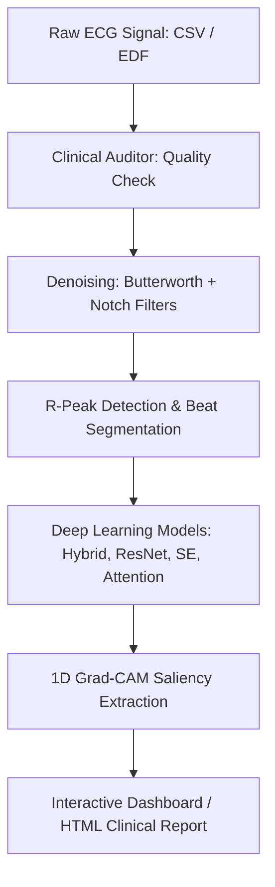

# 🫀 CardioVision: Explainable Deep Learning for ECG Arrhythmia Detection

[](https://www.python.org/)
[](https://pytorch.org/)
[](https://streamlit.io/)
[](LICENSE)

**CardioVision** is an end-to-end, explainable deep learning platform designed for clinical ECG analysis and cardiac arrhythmia detection. Built using **PyTorch** and **Streamlit**, CardioVision features a state-of-the-art hybrid deep learning pipeline that preprocesses raw ECG signals, performs safety audits, segments cardiac beats, classifies them into four diagnostic categories, and produces clinician-interpretable heatmaps via **1D Grad-CAM**.

---

## 🌟 Key Features

- **Multi-Architecture Support**: Train and evaluate four distinct hybrid deep learning architectures:
  - `hybrid`: Convolutional Neural Network (CNN) combined with a Bidirectional LSTM (BiLSTM) network.
  - `attention`: CNN-BiLSTM integrated with a **Self-Attention** layer to highlight critical temporal dependencies.
  - `resnet`: Hybrid model incorporating **Residual Blocks** (ResNet) to facilitate gradient flow.
  - `se`: Hybrid model using **Squeeze-and-Excitation (SE) Blocks** for channel-wise feature calibration.
- **Rule-Based Clinical Auditing**: Automatically verifies ECG signal quality, calculates missing data ratios, flags low-amplitude/flatline segments, and assigns a signal severity warning (`PASS`, `WARNING`, or `CRITICAL`).
- **Robust Signal Processing**: Implements a Butterworth bandpass filter (0.5–40 Hz) for baseline wander and high-frequency noise removal, a Notch filter (60 Hz) for powerline interference reduction, and missing-value imputation.
- **Explainable AI (XAI)**: Generates **1D Grad-CAM** visual saliency maps directly overlaid on the ECG waveform, highlighting the morphological regions (e.g., P-wave, QRS-complex, T-wave) that drove the model's decision.
- **Interactive Streamlit Web Dashboard**: A premium, dark-themed dashboard designed for clinical simulation, allowing users to upload EDF/CSV signals, train models, run interactive inference, and explore explainability maps.
- **Automated Clinical Reporting**: Exports interactive or static, clean clinical reports in HTML format, combining raw signal audits, prediction probabilities, and Grad-CAM visualizations.
- **Robust Test Coverage**: Includes unit tests for preprocessing, model dimensions, and Grad-CAM hooks.

---

## 🏗️ System Pipeline

The CardioVision pipeline consists of six primary stages:



1. **Clinical Auditing**: Analyzes raw signals for structural anomalies, flatlines, extreme outliers, and missing values.
2. **Denoising**: Filters out baseline wander, electromyogram (EMG) noise, and powerline interference.
3. **Beat Segmentation**: Extracts R-peak centered windows of 360 samples (1 second at 360 Hz) and applies Z-score normalization.
4. **Deep Learning Classification**: Predicts the cardiac beat type across four major classes.
5. **Interpretability (XAI)**: Extracts gradients from the last convolutional layer to compute heatmaps.
6. **Reporting**: Assembles the findings into a downloadable clinical report.

---

## 📂 Project Directory Structure

The repository has been cleaned to include only necessary source code files and setup resources:

```
.
├── app.py                     # Streamlit web application
├── main.py                    # CLI entry point (download, train, evaluate, etc.)
├── config.py                  # Global settings, paths, and hyperparameters
├── requirements.txt           # Python dependency file
├── .gitignore                 # Excluded directories (local datasets, models, caches)
├── Cardio Vision.pdf          # Research report / documentation file
├── project_report.pdf         # Research summary file
├── data/                      # Directory for dataset storage
│   ├── processed/             # Preprocessed .npz files (gitignored)
│   └── raw/                   # Raw downloaded record files (gitignored)
├── models/                    # Directory for saving model weights (gitignored)
├── reports/                   # Location for generated clinical HTML reports (gitignored)
├── src/                       # Main source package
│   ├── explainability/        # 1D Grad-CAM implementation
│   ├── model/                 # Model architectures (hybrid, resnet, attention, se) & Trainer
│   ├── preprocessing/         # Filters, loaders, auditors, and imputers
│   ├── reporting/             # HTML/Matplotlib report generator
│   └── utils/                 # General helpers (seeding, parameter counting, device detection)
└── tests/                     # Unit test suite
```

---

## ⚙️ Installation & Setup

### 1. Prerequisites
- **Python**: Version 3.8 to 3.11 is recommended.
- **Hardware**: Compatible with CPU execution, but a CUDA-capable GPU (such as RTX 4060) is highly recommended for faster model training.

### 2. Clone the Repository
```bash
git clone https://github.com/yourusername/CardioVision.git
cd CardioVision
```

### 3. Set Up a Virtual Environment
```bash
python -m venv venv
source venv/bin/activate  # On Windows: venv\Scripts\activate
```

### 4. Install Dependencies
```bash
pip install -r requirements.txt
```

---

## 🚀 Usage Guide

CardioVision can be run using the interactive **Streamlit Dashboard** or via the **Command-Line Interface (CLI)**.

### 🖥️ Streamlit Web Application
To launch the interactive, browser-based clinical dashboard:
```bash
streamlit run app.py
```
Open [http://localhost:8501](http://localhost:8501) in your browser. The app includes five sections:
1. **Dashboard**: High-level overview of the pipeline, architecture flowcharts, and local database status.
2. **Upload & Preprocess**: Upload your own CSV or EDF signals, run the clinical auditor, or process the complete MIT-BIH dataset.
3. **Train Model**: Train model architectures, monitor loss curves in real-time, and view confusion matrices.
4. **Inference & Explain**: Run inference on standard beats or uploaded files, and visualize Grad-CAM activation maps.
5. **Reports**: Generate, preview, and download HTML clinical reports.

---

### 💻 Command-Line Interface (CLI)

The `main.py` script serves as a multi-functional CLI for automation:

#### 1. Download the MIT-BIH Database
Downloads the full database (48 records) from PhysioNet:
```bash
python main.py download
```

#### 2. Preprocess & Segment Beats
Preprocesses the downloaded signals, runs quality auditing, and saves the segmented heartbeats into `data/processed/mitbih_processed.npz`:
```bash
python main.py preprocess
```

#### 3. Train Model
Train a specific model variant (options: `hybrid`, `attention`, `resnet`, `se`):
```bash
python main.py train --arch hybrid --epochs 50 --batch-size 128 --lr 0.001
```

#### 4. Evaluate Model
Evaluate a trained model's performance on the test split:
```bash
python main.py evaluate --arch hybrid
```

#### 5. Generate Clinical Reports
Generate sample HTML clinical reports with Grad-CAM overlays for each of the classification categories:
```bash
python main.py report --arch hybrid
```

#### 6. Run Tests
Verify codebase integrity using `pytest`:
```bash
python main.py test
```
*(Or run `pytest tests/ -v` directly)*

---

## 🔬 ECG Beat Classes

CardioVision maps the standard MIT-BIH annotation codes into four clinically meaningful classes:

| Class ID | Class Name | MIT-BIH Annotations Mapped | Clinical Description |
| :---: | :---: | :---: | :--- |
| **0** | **Normal** | `N`, `L`, `R` | Normal beats, Left/Right bundle branch block beats. |
| **1** | **AFib** | `A`, `a`, `J`, `S`, `e`, `j` | Atrial Premature, Aberrant Junctional, Nodal, or Escaped beats. |
| **2** | **PVC** | `V`, `E` | Premature Ventricular Contraction and Ventricular Escape beats. |
| **3** | **Global** | `/`, `f`, `F`, `Q`, `!` | Paced beats, Fusion of paced/normal beats, or unclassifiable beats. |

---

## 📜 License & Acknowledgments

- **License**: Distributed under the MIT License. See `LICENSE` for details.
- **Dataset**: Powered by the **MIT-BIH Arrhythmia Database** hosted on PhysioNet.
- **Reference Papers**: Hybrid CNN-LSTM modeling and interpretability schemas for clinical electrocardiogram diagnostic tools.
